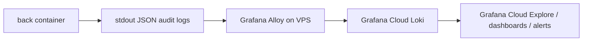

# Grafana Cloud Audit Logging

## What is in scope now

This setup keeps the audit logic in the app and sends the logs to Grafana Cloud instead of a self-hosted Grafana/Loki stack.

Current coverage:

- auth: login, register, logout
- identity and org context: role switch, organization switch
- org management: organization update, location create
- invitations: list, create, delete, invite-code read, invite-code create
- scheduling: workday list, workday create, workday publish, interval list, interval create, interval update, interval delete
- clock: clock-in, clock-out, clock list

Transport path:



By default Alloy ships only structured JSON lines from the `back` container. Plaintext logs are dropped. That is intentional: lower Grafana Cloud volume, lower noise, lower cardinality.

## Audit event contract

Every audit event is a single JSON line with:

- `@timestamp`
- `kind="audit"`
- `schema_version`
- `level`
- `service`
- `environment`
- `event_type`
- `outcome`
- `status`
- `status_class`
- `route`
- `reason`
- `request`
- `actor`
- `target`
- `metadata`

### Request fields

- `request.id`
- `request.method`
- `request.path`
- `request.ip`
- `request.user_agent`

### Actor fields

- `actor.auth_state`
- `actor.user_id`
- `actor.organization_id`
- `actor.access_role`
- `actor.primary_mode`
- `actor.employee_id`

### Target fields

- `target.type`
- `target.id`
- `target.organization_id`
- `target.location_id`
- `target.workday_id`
- `target.employee_id`
- `target.invitation_id`

## Hard audit: what must be sent to Grafana Cloud

### Must log now

- Auth outcomes:
  - successful login
  - invalid credentials
  - disabled account attempts
  - registration success
  - duplicate email conflicts
  - logout
- Permission boundaries:
  - `401`
  - `403`
  - sensitive route denials
- Org-level writes:
  - organization settings update
  - location create
- Invitation flows:
  - invitation list
  - invitation create
  - invitation delete
  - invite-code read
  - invite-code create
- Scheduling reads/writes:
  - workday list
  - workday create
  - workday publish
  - interval list
  - interval create
  - interval update
  - interval delete
- Clock actions:
  - clock-in
  - clock-out
  - denied cross-employee access
  - clock entry list

### Second wave

- cash settings and cash session lifecycle
- payroll reads
- employee earnings
- onboarding state transitions
- procedure answers and procedure sync
- internal cron and auto-close jobs
- presign routes

## Never send

- passwords or password hashes
- session cookies or session tokens
- invitation tokens or invite URLs
- access tokens or API keys
- raw `Authorization` headers
- raw request bodies
- cash or payroll payload dumps
- private media URLs if they expose storage paths

## Labels and cost discipline

Low-cardinality labels sent to Grafana Cloud:

- `app`
- `compose_service`
- `environment`
- `event_type`
- `kind`
- `level`
- `method`
- `outcome`
- `route`
- `service`
- `source`
- `stack`
- `status_class`

High-cardinality fields stay in structured metadata:

- `request_id`
- `request_path`
- `actor_user_id`
- `organization_id`
- `target_id`
- `reason`

## Files in repo

- `compose.observability.yml`
- `infra/observability/alloy/config.alloy`
- `lib/observability/audit.ts`

## VPS guide

### 1. Prepare Grafana Cloud

In Grafana Cloud, open the Logs / Loki connection details and copy:

- Loki push URL
- Loki username / tenant id
- access policy token with `logs:write`

### 2. Prepare `.env.production` on the VPS

Add:

```env
AUDIT_LOG_ENABLED=true
ALLOY_HTTP_PORT=12345
GRAFANA_CLOUD_LOKI_URL=https://logs-prod-XXX.grafana.net/loki/api/v1/push
GRAFANA_CLOUD_LOKI_USERNAME=CHANGE_ME_GRAFANA_CLOUD_LOKI_USERNAME
GRAFANA_CLOUD_LOGS_TOKEN=CHANGE_ME_GRAFANA_CLOUD_LOGS_TOKEN
```

`APP_SERVICE_NAME` is already set in `compose.app.yml`. Audit events from API traffic go out as `crewlly-back`.

### 3. Deploy app changes

```bash
cd /home/ubuntu/crewlly
git pull --ff-only origin main
docker network inspect app_net >/dev/null 2>&1 || docker network create app_net
docker compose --env-file .env.production -f compose.app.yml up -d --build front back
```

### 4. Deploy Alloy

```bash
cd /home/ubuntu/crewlly
docker compose --env-file .env.production -f compose.observability.yml up -d
```

### 5. Verify Alloy on the VPS

```bash
docker compose --env-file .env.production -f compose.observability.yml ps
docker compose --env-file .env.production -f compose.observability.yml logs --tail=100 alloy
curl http://127.0.0.1:12345/-/ready
```

### 6. Verify in Grafana Cloud

Open Grafana Cloud Explore and run:

```logql
{app="crewlly", kind="audit"}
```

Denied actions:

```logql
{app="crewlly", kind="audit", outcome="denied"}
```

Auth problems:

```logql
{app="crewlly", kind="audit", event_type=~"auth\\..+", outcome!="success"}
```

Schedule changes:

```logql
{app="crewlly", kind="audit", event_type=~"interval\\..+|workday\\..+"}
```

### 7. Alerts to add in Grafana Cloud

- spike in `outcome="denied"` for `auth.login`
- unusual volume of `invite_code.read`
- burst of `interval.delete`
- any `organization.update`
- any `failure` on schedule or clock flows

## Security notes

- There is no self-hosted Grafana or Loki in this repo anymore.
- Alloy is localhost-only on the VPS.
- Alloy reads Docker logs through `/var/run/docker.sock`; that is privileged host access. Do not expose Alloy publicly.
- If you want stricter isolation later, replace direct Docker socket access with a socket proxy.
