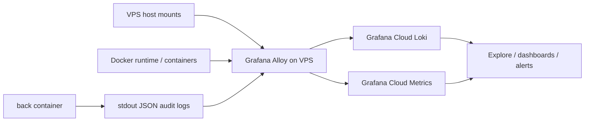

# Grafana Cloud Observability

## What is in scope now

This setup keeps observability on the VPS lightweight:

- audit logs go to Grafana Cloud Loki
- VPS resource metrics go to Grafana Cloud Metrics
- Docker container resource metrics go to Grafana Cloud Metrics

Current log coverage:

- auth: login, register, logout
- identity and org context: role switch, organization switch
- org management: organization update, location create
- invitations: list, create, delete, invite-code read, invite-code create
- scheduling: workday list, workday create, workday publish, interval list, interval create, interval update, interval delete
- clock: clock-in, clock-out, clock list
- internal cron: stale shift auto-close runs
- internal cron: work interval consistency checks

Current metrics coverage:

- VPS: CPU, load, RAM, swap, disk usage, inode usage, filesystem latency/basic IO, network traffic
- containers: CPU, memory, network, filesystem usage, CPU throttling, uptime/last seen, top resource consumers

Transport path:



Why this design:

- no self-hosted Prometheus TSDB on the VPS
- one observability agent instead of several collectors
- existing Alloy deployment stays the control point for both logs and metrics

## Architecture notes

Alloy now performs three roles:

- tails Docker logs and forwards structured audit logs to Loki
- runs the equivalent of node_exporter for host metrics
- runs cAdvisor for Docker container metrics

Important operational note:

- the Alloy container now requires host mounts and `privileged: true` to read host/container metrics correctly
- Alloy HTTP UI still binds only to `127.0.0.1:${ALLOY_HTTP_PORT}`
- exporters are not exposed publicly

## Metric labels and cost discipline

Metrics keep a small stable label set where possible:

- `app="crewlly"`
- `stack="crewlly"`
- `instance`
- `job`
- `compose_service`
- `compose_project`
- `container_name`

Cost controls already applied:

- Linux exporter disables noisy collectors such as `ipvs`, `btrfs`, `infiniband`, `xfs`, `zfs`
- Linux exporter excludes ephemeral filesystems and Docker storage mounts from filesystem metrics
- Linux exporter ignores loopback and transient `veth*` interfaces in network metrics
- cAdvisor disables root cgroup stats
- cAdvisor allowlists only the Docker Compose labels needed for grouping

## Audit event contract

Every audit event is a single JSON line with:

- `@timestamp`
- `kind="audit"`
- `schema_version`
- `level`
- `service`
- `environment`
- `event_type`
- `outcome`
- `status`
- `status_class`
- `route`
- `reason`
- `request`
- `actor`
- `target`
- `metadata`

### Request fields

- `request.id`
- `request.method`
- `request.path`
- `request.ip`
- `request.user_agent`

### Actor fields

- `actor.auth_state`
- `actor.user_id`
- `actor.organization_id`
- `actor.access_role`
- `actor.primary_mode`
- `actor.employee_id`

### Target fields

- `target.type`
- `target.id`
- `target.organization_id`
- `target.location_id`
- `target.workday_id`
- `target.employee_id`
- `target.invitation_id`

## Never send

- passwords or password hashes
- session cookies or session tokens
- invitation tokens or invite URLs
- access tokens or API keys
- raw `Authorization` headers
- raw request bodies
- cash or payroll payload dumps
- private media URLs if they expose storage paths

## Files in repo

- `compose.observability.yml`
- `infra/observability/alloy/config.alloy`
- `lib/observability/audit.ts`
- `.github/workflows/deploy-observability.yml`

## VPS guide

### 1. Prepare Grafana Cloud

In Grafana Cloud, collect both Logs and Metrics connection details.

For Logs / Loki:

- Loki push URL
- Loki username / tenant id
- access policy token with `logs:write`

For Metrics / Prometheus:

- Prometheus remote_write URL
- Prometheus username / tenant id
- access policy token with `metrics:write`

Recommended:

- in Grafana Cloud Connections, install the `Linux Server` integration
- in Grafana Cloud Connections, install the `Docker` integration

The Alloy config uses these job labels so the built-in dashboards and alerts can work immediately:

- `job="integrations/node_exporter"`
- `job="integrations/docker"`

### 2. Prepare `.env.production` on the VPS

Add:

```env
AUDIT_LOG_ENABLED=true
ALLOY_HTTP_PORT=12345

GRAFANA_CLOUD_LOKI_URL=https://logs-prod-XXX.grafana.net/loki/api/v1/push
GRAFANA_CLOUD_LOKI_USERNAME=CHANGE_ME_GRAFANA_CLOUD_LOKI_USERNAME
GRAFANA_CLOUD_LOGS_TOKEN=CHANGE_ME_GRAFANA_CLOUD_LOGS_TOKEN

GRAFANA_CLOUD_PROMETHEUS_URL=https://prometheus-prod-XXX.grafana.net/api/prom/push
GRAFANA_CLOUD_PROMETHEUS_USERNAME=CHANGE_ME_GRAFANA_CLOUD_PROMETHEUS_USERNAME
GRAFANA_CLOUD_METRICS_TOKEN=CHANGE_ME_GRAFANA_CLOUD_METRICS_TOKEN
```

`APP_SERVICE_NAME` is already set in `compose.app.yml`. Audit events from API traffic and internal cron runs go out as `crewlly-back`.

### 3. Deploy app changes

```bash
cd /home/ubuntu/crewlly
git pull --ff-only origin main
docker network inspect app_net >/dev/null 2>&1 || docker network create app_net
docker compose --env-file .env.production -f compose.app.yml up -d --build
```

### 4. Deploy Alloy

```bash
cd /home/ubuntu/crewlly
docker compose --env-file .env.production -f compose.observability.yml up -d
```

If you deploy through GitHub Actions, pushing these changes to `main` will trigger:

- `.github/workflows/deploy-observability.yml`

### 5. Verify Alloy on the VPS

```bash
docker compose --env-file .env.production -f compose.observability.yml ps
docker compose --env-file .env.production -f compose.observability.yml logs --tail=100 alloy
curl http://127.0.0.1:12345/-/ready
curl http://127.0.0.1:12345/metrics | grep -E 'alloy|prometheus_remote_storage'
```

If Alloy fails to start, inspect:

- missing Grafana Cloud env vars
- host bind mounts unavailable on the VPS
- Docker daemon path differences

### 6. Verify logs in Grafana Cloud

Open Grafana Cloud Explore and run:

```logql
{app="crewlly", kind="audit"}
```

Denied actions:

```logql
{app="crewlly", kind="audit", outcome="denied"}
```

Auth problems:

```logql
{app="crewlly", kind="audit", event_type=~"auth\\..+", outcome!="success"}
```

Schedule changes:

```logql
{app="crewlly", kind="audit", event_type=~"interval\\..+|workday\\..+"}
```

Cron auto-close runs:

```logql
{app="crewlly", kind="audit", event_type="cron.shift_auto_close.run"}
```

Cron consistency checks:

```logql
{app="crewlly", kind="audit", event_type="cron.work_interval_consistency.run"}
```

Cron failures:

```logql
{app="crewlly", kind="audit", event_type=~"cron\\.shift_auto_close\\.run|cron\\.work_interval_consistency\\.run", outcome!="success"}
```

### 7. Verify metrics in Grafana Cloud

Open Grafana Cloud Explore and run the queries below.

#### VPS

CPU usage:

```promql
100 * (1 - avg by (instance) (rate(node_cpu_seconds_total{job="integrations/node_exporter", mode="idle"}[5m])))
```

Load average:

```promql
node_load1{job="integrations/node_exporter"}
```

RAM used percent:

```promql
100 * (1 - (node_memory_MemAvailable_bytes{job="integrations/node_exporter"} / node_memory_MemTotal_bytes{job="integrations/node_exporter"}))
```

Swap used percent:

```promql
100 * (1 - (node_memory_SwapFree_bytes{job="integrations/node_exporter"} / node_memory_SwapTotal_bytes{job="integrations/node_exporter"}))
```

Disk usage percent by filesystem:

```promql
100 * (1 - (node_filesystem_avail_bytes{job="integrations/node_exporter", fstype!=""} / node_filesystem_size_bytes{job="integrations/node_exporter", fstype!=""}))
```

Inode usage percent by filesystem:

```promql
100 * (1 - (node_filesystem_files_free{job="integrations/node_exporter", fstype!=""} / node_filesystem_files{job="integrations/node_exporter", fstype!=""}))
```

Filesystem IO time:

```promql
rate(node_disk_io_time_seconds_total{job="integrations/node_exporter"}[5m])
```

Disk reads/writes bytes:

```promql
rate(node_disk_read_bytes_total{job="integrations/node_exporter"}[5m]) + rate(node_disk_written_bytes_total{job="integrations/node_exporter"}[5m])
```

Network traffic:

```promql
rate(node_network_receive_bytes_total{job="integrations/node_exporter"}[5m]) + rate(node_network_transmit_bytes_total{job="integrations/node_exporter"}[5m])
```

#### Containers

Container CPU cores used:

```promql
sum by (compose_service, container_name) (
  rate(container_cpu_usage_seconds_total{job="integrations/docker", name!=""}[5m])
)
```

Container memory working set:

```promql
sum by (compose_service, container_name) (
  container_memory_working_set_bytes{job="integrations/docker", name!=""}
)
```

Container network traffic:

```promql
sum by (compose_service, container_name) (
  rate(container_network_receive_bytes_total{job="integrations/docker", name!=""}[5m]) +
  rate(container_network_transmit_bytes_total{job="integrations/docker", name!=""}[5m])
)
```

Container filesystem usage:

```promql
sum by (compose_service, container_name) (
  container_fs_usage_bytes{job="integrations/docker", name!=""}
)
```

Container CPU throttling ratio:

```promql
100 *
sum by (compose_service, container_name) (
  rate(container_cpu_cfs_throttled_periods_total{job="integrations/docker", name!=""}[5m])
)
/
clamp_min(
  sum by (compose_service, container_name) (
    rate(container_cpu_cfs_periods_total{job="integrations/docker", name!=""}[5m])
  ),
  1
)
```

Container uptime:

```promql
time() - container_start_time_seconds{job="integrations/docker", name!=""}
```

Container last seen:

```promql
time() - container_last_seen{job="integrations/docker", name!=""}
```

Top 5 CPU consumers:

```promql
topk(5, sum by (compose_service, container_name) (rate(container_cpu_usage_seconds_total{job="integrations/docker", name!=""}[5m])))
```

Top 5 memory consumers:

```promql
topk(5, sum by (compose_service, container_name) (container_memory_working_set_bytes{job="integrations/docker", name!=""}))
```

### 8. Recommended first alerts

Host alerts:

- CPU usage above `85%` for `10m`
- RAM used above `90%` for `10m`
- swap used above `25%` for `10m`
- filesystem usage above `80%` warning and `90%` critical
- inode usage above `80%` warning and `90%` critical
- no `up{job="integrations/node_exporter"}` for the host

Container alerts:

- no `up{job="integrations/docker"}` from Alloy/cAdvisor pipeline
- `time() - container_last_seen > 120`
- container memory working set abnormally high versus expected baseline
- CPU throttling ratio above `20%` for `10m`
- top consumers dashboard shows unexpected spikes on `back`, `front`, `db`, `minio`, `caddy`, `internal_scheduler`

### 9. Rollback

If metrics collection causes issues on the VPS:

```bash
cd /home/ubuntu/crewlly
git revert <commit>
docker compose --env-file .env.production -f compose.observability.yml up -d
```

As a temporary emergency fallback you can also stop only Alloy:

```bash
docker compose --env-file .env.production -f compose.observability.yml stop alloy
```

This disables both log shipping and metrics shipping until the stack is restored.
